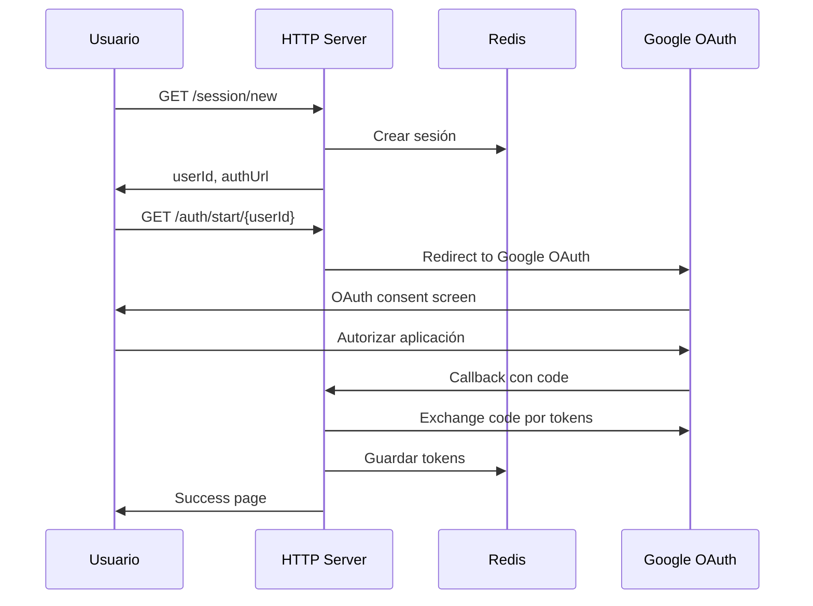

# Google Workspace MCP Backend

Backend multi-tenant para integración con Google Workspace APIs usando el protocolo MCP (Model Context Protocol).

## Arquitectura

### Estructura del Proyecto

```
backend/
├── src/
│   ├── types/           # Definiciones TypeScript y esquemas Zod
│   ├── services/        # Servicios de negocio (Gmail, Drive, Calendar, Auth, Session)
│   ├── middleware/      # Middleware Express (auth, validation)
│   ├── routes/          # Rutas HTTP (auth, MCP)
│   ├── server.ts        # Servidor MCP stdio
│   ├── app.ts          # Servidor HTTP Express
│   └── index.ts        # Punto de entrada unificado
├── tools/              # Herramientas MCP legacy (a refactorizar)
├── dist/               # Build output
└── package.json
```

### Componentes Principales

#### 1. **Servicios (Services Layer)**
- **AuthService**: Manejo de OAuth 2.0 con Google
- **SessionService**: Gestión de sesiones de usuario con Redis
- **GmailService**: Operaciones con Gmail API
- **DriveService**: Operaciones con Google Drive API
- **CalendarService**: Operaciones con Google Calendar API

#### 2. **Middleware**
- **Auth Middleware**: Autenticación y autorización de usuarios
- **Validation Middleware**: Validación de requests usando Zod schemas

#### 3. **Rutas (Routes)**
- **Auth Routes**: Endpoints de autenticación OAuth
- **MCP Routes**: Endpoints compatibles con protocolo MCP sobre HTTP

#### 4. **Servidores**
- **MCP Stdio Server**: Servidor que usa el protocolo MCP moderno con `McpServer` class
- **HTTP Server**: Servidor Express multi-tenant para acceso web

### Flujo de Autenticación



### Protocolo MCP

El servidor implementa el protocolo MCP moderno usando la clase `McpServer` del SDK actualizado:

#### Herramientas Disponibles

1. **gmail_search**: Buscar emails con operadores Gmail
2. **gmail_send**: Enviar emails
3. **gmail_read**: Leer email completo por ID
4. **drive_search**: Buscar archivos en Drive
5. **drive_read**: Leer contenido de archivos
6. **drive_list**: Listar archivos en carpeta
7. **calendar_list_events**: Listar eventos de calendario
8. **calendar_create_event**: Crear evento en calendario
9. **calendar_get_event**: Obtener detalles de evento

#### Formato de Respuesta MCP

```json
{
  "jsonrpc": "2.0",
  "result": {
    "content": [
      {
        "type": "text",
        "text": "{\"data\": \"...\"}"
      }
    ]
  },
  "id": 1
}
```

### Modos de Ejecución

#### Modo HTTP (por defecto)
```bash
npm run dev:http    # Desarrollo
npm start          # Producción
```

#### Modo MCP Stdio
```bash
npm run dev:mcp     # Desarrollo
MCP_MODE=true npm start  # Producción
```

### Variables de Entorno

```env
# Google OAuth
GOOGLE_CLIENT_ID=your_client_id
GOOGLE_CLIENT_SECRET=your_client_secret

# Servidor
PORT=3000
PUBLIC_URL=https://your-domain.com
CORS_ORIGIN=*

# Redis
REDIS_URL=redis://localhost:6379

# Entorno
NODE_ENV=development
```

### Endpoints HTTP

#### Autenticación
- `GET /health` - Health check
- `GET /session/new` - Crear nueva sesión
- `GET /auth/start/:userId` - Iniciar OAuth flow
- `GET /auth/callback` - Callback de OAuth
- `GET /status/:userId` - Estado de usuario
- `POST /disconnect/:userId` - Desconectar usuario

#### MCP sobre HTTP
- `POST /mcp/:userId` - Endpoint MCP para usuario específico

### Arquitectura Multi-tenant

Cada usuario tiene su propia sesión y tokens OAuth almacenados en Redis:

```
Redis Keys:
- session:{userId} -> UserSession
- tokens:{userId} -> UserTokens
```

Los servicios se instancian por usuario con sus propios tokens OAuth.

### Validación y Type Safety

- **Zod schemas** para validación de entrada
- **TypeScript interfaces** para type safety
- **Middleware de validación** centralizado
- **Error handling** consistente

### Próximos Pasos

1. **Documentación completa** con diagramas detallados
2. **Refactorizar herramientas legacy** en `tools/` directory
3. **Testing** exhaustivo de funcionalidad
4. **Logging** mejorado y monitoreo
5. **Rate limiting** y seguridad adicional